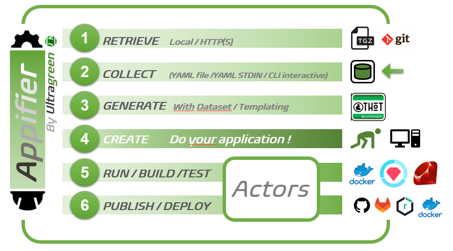

# Appifier

Appifier : Applications templating and management tools 

<noscript></noscript>

 
_Applications templating and management tools_

## Installation

    $ gem install appifier

## Usage

Appifier : Manage your applications templates, build, deploy, publish any type of application (CLI, web, etc...) in any languages with any facilities.  

## Process

 

## Development

After checking out the repo, run `bin/setup` to install dependencies. Then, run `rake spec` to run the tests. You can also run `bin/console` for an interactive prompt that will allow you to experiment.

To install this gem onto your local machine, run `bundle exec rake install`. To release a new version, update the version number in `version.rb`, and then run `bundle exec rake release`, which will create a git tag for the version, push git commits and tags, and push the `.gem` file to [rubygems.org](https://rubygems.org).

## Contributing

Bug reports and pull requests are welcome on GitHub at https://github.com/Ultragreen/appifier.

## License

The gem is available as open source under the terms of the [MIT License](https://opensource.org/licenses/MIT).
